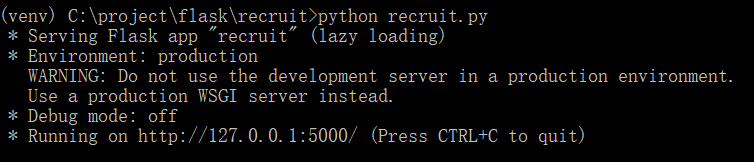

# About
关于这个项目的详细说明可以移步到我的博客文章[【Vue+Flask】前端到后端通关之路（2）](http://maklok.com/blog/2018/06/21/article10002/)

## 项目运行
先建好数据库、数据表，代码中修改连接数据库时用到的用户名、密码、数据库名
然后执行handle文件夹内的3个python文件（过程中pip install 依赖包）
/handle/lagou_industry.py是爬取行业名，这个数据量不多，很快就爬取完了（注意修改27行，填你的cookie）
/handle/lagou_jobs.py是爬取具体的招聘详情，这个数据量非常大，几十万条，爬了我10多个小时（希望有大神能指教一下有没有办法缩短时间，同样要修改46行，填你的cookie）
/handle/lagou_analyses.py是整合分析结果写入数据库，这个也比较耗时，要8、9个小时（同求优化途径~~~）

handle文件夹中的3个文件运行完毕，你的数据库中就有了初始数据了。然后在项目根目录运行python recruit.py
运行成功截图：
 
运行成功之后用Postman工具请求http://127.0.0.1:5000/recruit/getCities，有数据返回则代表成功